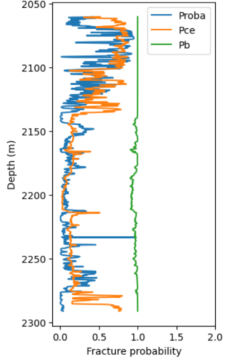

# FractureDetection
Looking for a fracture plausibility using wireline log data.

It is adapted after Aguilerra (1995) on "Naturally Fractured Reservoir" book. A method is developed to detect fracture using wireline log by calculating its possibility in depth. Logs are categorized into five categories:
1. Electrical category
2. Multi-pad category
3. Radioactivity category
4. Rugosity category
5. Acoustic category

Plausibility are calculated for each one category using "criterion" which then combined as a final plausibility using Bayesian logic. In this code, I already attached some calculation to carry out this work. However, the result of Bayesian logic to calculate final plausibility seems not reasonable in this case because it leads to a very high probability on almost all depth. An element in the logic includes several fraction multiplication which yield a very small number, it might not represent the true plausibility. Thus I tried to introduce a cross entropy in this code to calculate the final plausibility. Moreover, I equipped the algorithm with neural net using PyTorch in case you already have fracture data and want to perform a supervised learning through it.

Notes:
Pb: probability using Bayesian logic
Pce: probability using cross entropy
Proba: probability using neural net

I also made it in Google Colab :D If you're interested feel free to check

Next: I want to improve using fracture porosity

Any kind of suggestions are welcome!
